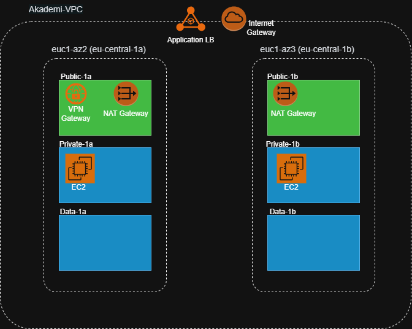

# ☁️ AWS High-Availability & Secure 3-Tier Infrastructure

This repository contains a robust, production-ready AWS infrastructure designed with **High Availability (HA)** and **Layered Security** principles. The architecture follows the 3-tier networking model to ensure isolation and fault tolerance.

## 🏗️ Solution Architecture

### Key Architectural Highlights:
* **VPC Design:** A custom VPC with a /16 CIDR block, segmented into 6 subnets (2 Public, 2 Private, 2 Data).
* **Multi-AZ Deployment:** Spanned across two Availability Zones (`eu-central-1a` and `eu-central-1b`) to ensure the system remains operational if one zone fails.
* **Tiered Segmentation:**
    1.  **Web Tier:** Public-facing Application Load Balancer.
    2.  **Application Tier:** EC2 Web Servers isolated in Private Subnets.
    3.  **Data Tier:** Dedicated subnets for RDS (Relational Database Service) with no direct internet access.

## 🛠️ Tech Stack & AWS Services

| Service | Role |
| :--- | :--- |
| **VPC & Subnets** | Logical network isolation and traffic routing. |
| **Application LB** | Distributes incoming HTTP/HTTPS traffic and performs health checks. |
| **NAT Gateway** | Allows private instances to access the internet for updates/patches securely. |
| **Amazon EC2** | Ubuntu-based web servers running Nginx. |
| **Pritunl (VPN)** | Management gateway for secure SSH and Database access. |
| **Amazon RDS** | High-availability database layer with automated failover. |

## 🚀 Security Implementation

### 1. Network Isolation (Private Subnets)
All application and database servers are hosted in **Private Subnets**. They have no Public IP addresses and are completely unreachable from the public internet. External traffic is only permitted via the **Application Load Balancer**.

### 2. Secure Management (VPN Access)
Instead of using a vulnerable Bastion Host, this architecture utilizes **Pritunl VPN**. Administrators connect via an encrypted tunnel to perform maintenance, SSH into private instances, or manage the database using private IP addresses.

### 3. Security Groups (Least Privilege)
Access is restricted using granular Security Group rules:
* **ALB SG:** Allows inbound traffic on Port 80/443 from `0.0.0.0/0`.
* **Web Server SG:** Only allows inbound traffic from the **ALB Security Group**.
* **Database SG:** Only allows inbound SQL traffic (3306/5432) from the **Web Server Security Group**.

## 📈 Future Enhancements
- [ ] **Infrastructure as Code (IaC):** Automate the entire stack using Terraform.
- [ ] **Auto Scaling Groups (ASG):** Implement dynamic horizontal scaling based on CPU/Traffic metrics.
- [ ] **S3 & CloudFront:** Offload static assets to S3 and distribute via CDN for lower latency.
- [ ] **Route 53:** Global DNS management and health-check based routing.

---
*Developed as a part of the LimonCloud Academy training program.*
